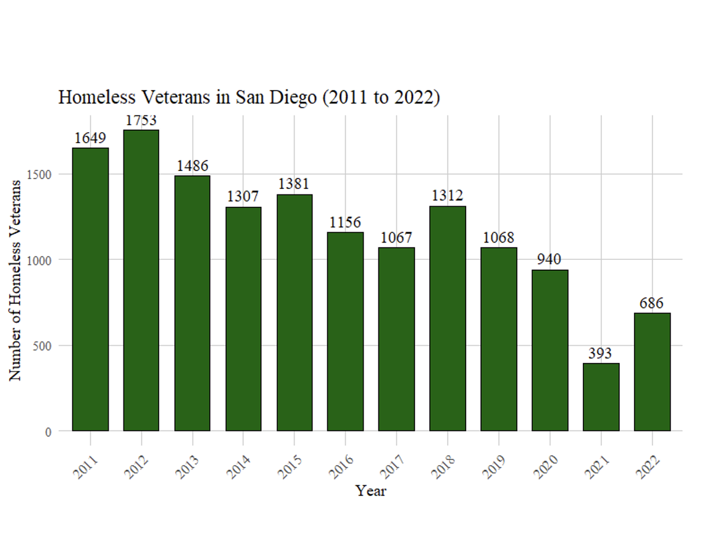

## Homelessness in San Diego, Factors that Impact Homelessness

This project explores **homelessness trends** in San Diego and across the United States, highlighting key factors such as urbanization, demographics, and geographic variations. The analysis was performed using **R Studio** for data analysis and visualization and **Power BI** for creating dashboards.

---

## Key Insights

- **Age Group Analysis:**  
   The **35–44 age group** is the most affected by homelessness, while seniors (65+) are the least affected, likely due to the availability of social support programs.

- **Urban vs. Rural:**  
   Major cities exhibit **significantly higher homelessness rates** compared to rural areas, driven by economic pressures, population density, and resource availability.

- **Demographics:**  
   Specific groups, including **men**, **people of color**, and **veterans**, face a disproportionately **higher risk of homelessness**.

---

## R Visualizations

The following visualizations were created using **R Studio** to analyze and communicate homelessness trends:

## R Visualizations
The following visualizations were created using **R Studio** to analyze and communicate homelessness trends:

### Homelessness by Age Group
  
*Figure 1: Homelessness by Age Group*

### Homelessness by County in California
  
*Figure 2: Homelessness by County in California*

### Homelessness by Sex
  
*Figure 3: Homelessness by Sex*

### Homelessness by Race
  
  
*Figures 4 & 5: Homelessness by Race*

### Homelessness among Veterans
  
*Figure 6: Homelessness among Veterans*

---

## Tools Used
- **R Studio**: Data cleaning, analysis, and visualizations
- **Power BI**: Interactive dashboards and visual insights
- **GitHub**: Code and project management

## Power BI Dashboard

We used Power BI to analyze and visualize homelessness and related trends across the U.S. and California. The dashboard includes interactive visuals showcasing homelessness by state, age, and race, trends in chronic homelessness, and the impact of drug overdoses. The slicers give detailed filtering by year and demographics to gain deeper insights.

## Key Insights:
- Homelessness Trends: California and New York have the highest homelessness rates.
- Post-2020 increase in homelessness linked to the pandemic
- Chronic Homelessness: PSH beds are increasing, but chronic homelessness remains a challenge.
- Drug Overdose in California: Opioids and synthetic drugs are the leading causes of overdose deaths.
- Demographics: The 	35–44 age group and racial minorities are most affected and Veteran homelessness is steadily declining.

View the interactive Power BI dashboard [clicking here](https://csusm-my.sharepoint.com/personal/roney007_csusm_edu/_layouts/15/onedrive.aspx?id=%2Fpersonal%2Froney007%5Fcsusm%5Fedu%2FDocuments%2F2024%2D2025%2FUpdated%20Power%20BI%20Dashboard%2Epbix&parent=%2Fpersonal%2Froney007%5Fcsusm%5Fedu%2FDocuments%2F2024%2D2025&ct=1733105881030&or=OWA%2DNT%2DMail&cid=66131f8e%2D0cd7%2D1d4e%2Dd8c4%2Ddb2b5563bf4f&ga=1).

---

